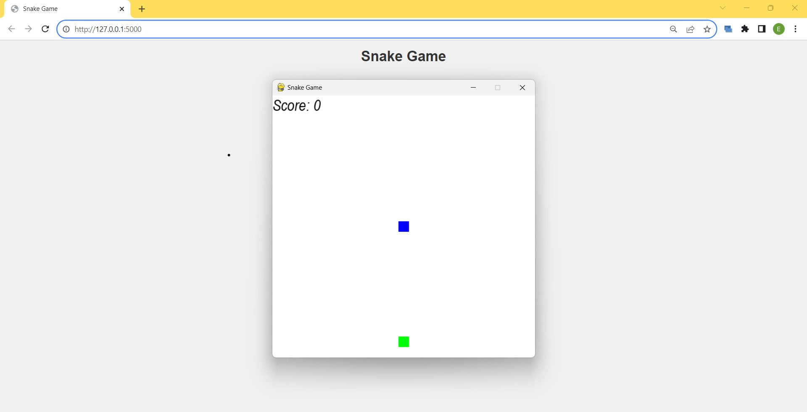

# Snake Game Web Application



## Description

This project combines a classic Snake game implemented in Python with the Pygame library and a Flask web application. The web application allows you to start and play the Snake game by clicking a button in the browser.

## Features

- Classic Snake Game: Play the timeless Snake game right in your web browser.
- Web Integration: Use Flask to serve the game and trigger it with a button click.
- Easy-to-Use: Simply click the "Start Game" button to launch and play the game.

## Requirements

Before running the Snake Game Web Application, ensure you have the following installed:

- Python
- Flask
- Pygame (for the Snake game)

You can install Pygame and Flask using pip:

```shell
pip install Pygame
pip install flask
```

## Installation

1. Clone this repository to your local machine:

```shell
   git clone https://github.com/tarunganesh2004/snake-game-web.git
```

2. Navigate to the project directory:

```shell
   cd snake-game-web
```

## Usage

1. Start the Flask Web Application

```shell
   python app.py
```

2. Access the web application in your web browser at 'http://localhost:5000'.

3. Click the "Start Game" button to launch and play the Snake game.

## Acknowledgments

- The Pygame community for providing the game development library.

- Flask developers for creating a versatile web framework.
